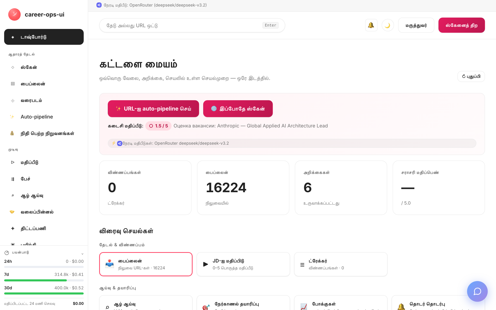

# career-ops-ui

> [career-ops](https://github.com/Fighter90/career-ops) AI வேலை-தேடல் பைப்லைனுக்கான தொழில்நுட்ப ஆவண நடையிலான, சுருக்கமான web இடைமுகம்.
> வேலைவாய்ப்புகளைத் தேடுங்கள், மதிப்பிடுங்கள், ஆழமான ஆராய்ச்சி செய்யுங்கள், விண்ணப்பித்து, ஆஃபர்களைக் கண்காணியுங்கள் — எல்லாம் ஒரே உலாவித் தாவலில்; Claude Code, டெர்மினல் மற்றும் markdown கோப்புகளுக்கு இடையிலான தொடர்ச்சியான மாற்றங்கள் இல்லை.

[🇬🇧 English](README.md) | [🇪🇸 Español](README.es.md) | [🇧🇷 Português (Brasil)](README.pt-BR.md) | [🇰🇷 한국어](README.ko-KR.md) | [🇯🇵 日本語](README.ja.md) | [🇷🇺 Русский](README.ru.md) | [🇨🇳 简体中文](README.zh-CN.md) | [🇹🇼 繁體中文](README.zh-TW.md) | [🇫🇷 Français](README.fr.md) | [🇵🇱 Polski](README.pl.md) | [🇺🇦 Українська](README.uk.md) | [🇩🇰 Dansk](README.da.md) | [🇸🇦 العربية](README.ar.md) | [🇩🇪 Deutsch](README.de.md) | [🇮🇹 Italiano](README.it.md) | [🇹🇷 Türkçe](README.tr.md) | [🇮🇳 हिन्दी](README.hi.md) | **🇮🇳 தமிழ்**

_அதிகாரப்பூர்வமற்ற இடைமுகம் — career-ops / santifer உடன் எந்தத் தொடர்பும் அல்ல, அவர்களால் அங்கீகரிக்கப்படவும் இல்லை._

[](#சோதனைகள்)
[](#சோதனைகள்)
[](#சோதனைகள்)
[](#தேவைகள்)
[](LICENSE)
[](https://github.com/Fighter90/career-ops-ui/releases/tag/v1.247.0)
[](https://mokevnin.github.io/agentic-coding-design-patterns/en/)

<a href="https://www.producthunt.com/products/career-ops-ui?embed=true&amp;utm_source=badge-featured&amp;utm_medium=badge&amp;utm_campaign=badge-career-ops-ui" target="_blank" rel="noopener noreferrer"></a>

> **🆕 சமீபத்திய வெளியீடு — v1.244.1** — **ஸ்கேன் குறியீடுகள் உண்மையான மதிப்புகளை அறிவிக்கின்றன; தலைப்பு-பிரிப்பு நாட்டுக் காவல்; ISO datetime meta தேதிகள்.** பூஸ்ட்/பிட்/ஸ்கோர் குறியீடுகளின் accessible பெயர்கள் மூல டிக்ட் டெம்ப்ளேட்களை ("Fit: {band}", "Boosted by {by}") கசிவு செய்தன — `{band}`/`{by}`/`{score}` இப்போது மாற்றப்படுகின்றன; "C++ | Rust | Go Developer | Onsite" போன்ற 4-பகுதி தலைப்பு "Go Developer"-ஐ நாடாகத் தவறாக எடுக்காது; meta தேதிகள் ஒவ்வொரு வரிசையிலும் render ஆகும்.
>
> **முந்தைய வெளியீடு — v1.244.0** — **ஸ்கேன் முடிவுகள் சுவராக அல்ல, பட்டியல் போல வாசிக்கப்படுகின்றன: ஒரு பதவி = இரு வரிகள், சமிக்ஞைகள் குறியீடுகள், 700 வரிசை ஸ்கேன் ஒரு paginated அட்டவணை.**

<p align="center"></p>

>
> 📜 முழு வெளியீட்டு வரலாறு: **[CHANGELOG.ta.md](CHANGELOG.ta.md)**.

<!-- DO NOT REVERT: locale-specific dashboard screenshot (dashboard-ru.png). Each README uses its own ./images/dashboard-<locale>.png — never replace with dashboard-en.png. Generated by scripts/capture-dashboard-screenshots.mjs. -->
[](https://youtu.be/LcVPUg9IsDk?si=mrx3oOmOpSAwabOz)

**[▶ முன்தோற்றத்தைப் பார்](https://youtu.be/LcVPUg9IsDk?si=mrx3oOmOpSAwabOz)**

### 🗺️ புதியது: எல்லா வேலைவாய்ப்புகளும் ஒரு வரைபடத்தில்

தேடல் முடிவுகள், நீரோட்டம் மற்றும் ட்ரேக்கர் ஒரே உலக வரைபடத்தில் (`#/map`) — ஆஃபர்கள் எங்கே குவிகின்றன, எந்த நகரங்களுக்குச் செல்லத் தகுந்தவை என்பது ஒரே பார்வையில். நிரப்பப்பட்ட புள்ளி = உங்கள் மதிப்பீட்டு மதிப்பெண்; வளையம் = தலைப்புப் பொருத்தம்; பொறி அறியப்பட்ட நிறுவன முகவரியில், இல்லையெனில் நகர மையத்தில் வைக்கப்படும் (OpenStreetMap இலவச geocoding, keys இல்லை).

<!-- TODO(design): restore when images/job-map-ta.png is captured (full map geocode pending) -->

## career-ops பற்றி

[career-ops](https://career-ops.org) என்பது எந்த AI coding CLI-க்குள்ளும் (Claude Code, Cursor, Codex, OpenCode, Antigravity CLI, Grok Build CLI, Qwen Code, Kimi, GitHub Copilot CLI, Gemini CLI (legacy) — பிற Claude-இசைவு CLIs அதே slash-command மேற்பரப்பு வழியாக வேலை செய்யும்) slash கட்டளைகளாக இயங்கும் திறந்த மூல வேலை தேடல் அமைப்பு. மாதிரி-சார்ந்ததல்ல. ஐந்து பரிமாணங்கள் கொண்ட 0.0–5.0 தரஅளவுகோல் மற்றும் ஒருங்கிணைந்த மொத்த மதிப்பெண்ணுடன் ஒவ்வொரு பதவியையும் உங்கள் CV-க்கு எதிராக மதிப்பிடும், வடிவமைக்கப்பட்ட PDF அனுபவ வரைவுகளை உருவாக்கும், ஒவ்வொரு விண்ணப்பத்தையும் உள்ளூரிலேயே கண்காணிக்கும் — கிளவுட் கணக்குகள், தொலைநோக்கி, தானியங்கி சமர்ப்பிப்பு இல்லை.

**இந்த repository (career-ops-ui)** — career-ops மீதான web இடைமுகம். CLI படிவங்களை நிரப்புவதற்கும் (Playwright MCP மூலம்) slash கட்டளைகளுக்கும் இன்னும் பொறுப்பு; SPA அதே `cv.md` / `data/applications.md` / `reports/` கோப்புகளுக்கு மேலே CRM-போன்ற உலாவி அடுக்கைச் சேர்க்கிறது. தரவு மூலம் CLI மற்றும் SPA இரண்டிற்கும் பொதுவானது.

**மதிப்பெண் வாரியான செயல் வரம்புகள்** ([career-ops.org/docs](https://career-ops.org/docs) பார்க்கவும்):

| மதிப்பெண் | அடுத்த படி |
|---|---|
| **≥ 4.5** | `/career-ops apply` — உயர் பொருத்தம், உடனே சமர்ப்பி |
| **4.0 – 4.4** | விண்ணப்பி, அல்லது வெதுவெதுப்பான அறிமுகத்திற்கு `/career-ops contacto` |
| **3.5 – 3.9** | `/career-ops deep` — முதலில் ஆராய் |
| **< 3.5** | குறிப்பிட்ட தனிப்பட்ட காரணம் இல்லையெனில் தாண்டு |

[career-ops.org/docs](https://career-ops.org/docs) இல் **அதிகாரப்பூர்வ வழிகாட்டிகள்**:

- [What is career-ops](https://career-ops.org/docs/introduction/what-is-career-ops)
- [Scan job portals](https://career-ops.org/docs/introduction/guides/scan-job-portals)
- [Apply for a job](https://career-ops.org/docs/introduction/guides/apply-for-a-job)
- [Batch-evaluate offers](https://career-ops.org/docs/introduction/guides/batch-evaluate-offers)
- [Set up Playwright](https://career-ops.org/docs/introduction/guides/set-up-playwright)
- [How career-ops scores job listings — methodology](https://career-ops.org/methodology)

## CareerOps Manifesto

career-ops [CareerOps Manifesto](https://career-ops.org/manifesto)-இன் முதல் குறிப்பு செயல்படுத்தல் — வேலை தேடலை சான்றுடன், ஒழுக்கத்துடன், மேசையின் வேட்பாளர் பக்கத்தில் கருவிகளுடன் நடத்தும் நடைமுறை. அதைப் படியுங்கள். உங்கள் நம்பிக்கையைச் சொல்கிறது என்றால் கையொப்பமிடுங்கள் — உங்கள் கையொப்பம் ஒரு பொது commit ஆகும். பயன்பாடு அதை பக்கப்பட்டியின் அடிக்குறிப்பிலிருந்து இணைக்கிறது.

இந்தப் பயன்பாடே coding agents உடன் கட்டப்பட்டது — [Agentic Coding Design Patterns](https://mokevnin.github.io/agentic-coding-design-patterns/ru/) ([ஆங்கிலப் பதிப்பு](https://mokevnin.github.io/agentic-coding-design-patterns/en/)) படி — இயங்கக்கூடிய காவலர்கள், பொதியப்பட்ட பணிப்பாதைகள், டொமைன் அகராதி, ADR-கள் மற்றும் workflow மதிப்பீடுகள். விக்கியின் [Agentic Practices](https://github.com/Fighter90/career-ops-ui/wiki/Agentic-Practices) பக்கம் எந்தப் பாட்டர்ன்கள் உண்மையில் அமலில் உள்ளன என்பதைத் தணிக்கை செய்கிறது.

## ஒரே கட்டளையில் தொடக்கம் மற்றும் init

> **முக்கியம் — career-ops-ui என்பது [`Fighter90/career-ops`](https://github.com/Fighter90/career-ops) மீதான டாஷ்போர்டு.** இது career-ops திட்டத்தின் **உள்ளே** `career-ops/web-ui/` ஆக இயங்குகிறது; உங்கள் `cv.md`, `config/`, `data/`-ஐ `../` வழியாகப் பெற்றோர் அடைவிலிருந்து வாசிக்கிறது. **தனித்து இயங்காது** — பெற்றோர் `career-ops` repository-உம் தேவை. தனியாக clone செய்யவும் `init` இயக்கவும் வேண்டாம்; கீழே உள்ள இரு விருப்பங்களில் ஒன்றைப் பயன்படுத்துங்கள்.

### விருப்பம் 1 — ஒரே curl (பரிந்துரைக்கப்படுகிறது: எல்லாம் அமைக்கும்)

```bash
curl -fsSL https://raw.githubusercontent.com/Fighter90/career-ops-ui/main/bin/setup.sh | bash
```

**இரு** repository-களையும் clone செய்யும், `career-ops/web-ui/` அமைப்பை உருவாக்கும், dependencies நிறுவும், doctor-ஐ இயக்கும், http://127.0.0.1:4317 இல் சர்வரைத் தொடங்கும் — பிறகு டாஷ்போர்டைத் திறக்கும்.

### விருப்பம் 2 — ஏற்கனவே உள்ள career-ops திட்டத்திற்கு UI-ஐச் சேர்

```bash
git clone https://github.com/Fighter90/career-ops.git
cd career-ops
git clone https://github.com/Fighter90/career-ops-ui.git web-ui
cd web-ui && npm install
npm start          # → http://127.0.0.1:4317
```

### CLI கட்டளைகள்

```bash
career-ops-ui setup      # dependencies → doctor → சர்வர்
career-ops-ui init       # LLM வழங்குநர் + கீ (echo suppressed)
career-ops-ui doctor     # எப்போது வேண்டுமானாலும் மீண்டும் சரிபார் (exit 0 ⇔ எல்லா தேவைகளும் பச்சை)
career-ops-ui run        # http://127.0.0.1:4317 இல் சர்வரைத் தொடங்கு
career-ops-ui open       # டாஷ்போர்டு தாவலைத் திறந்து முன்னுக்குக் கொண்டுவா
```

### LLM வழங்குநரைத் தேர்வு செய்தல்

கொண்டிருக்கும் **எந்த** ஒரு கீயும் வேலை செய்யும் (OR ஒப்பந்தம்). பல அமைக்கப்பட்டிருந்தால் `auto` இந்த வரிசையில் விரும்பும்: Anthropic → Gemini → OpenAI → Qwen → OpenRouter → GitHub Models → Hermes → DeepSeek → GLM (Z.ai) → Kimi (Moonshot) → MiniMax → Mistral → Grok (xAI) → Together → Fireworks → Ollama → BytePlus Ark → Volcengine Ark. கீ எதுவும் இல்லாவிட்டால் **Evaluate** நகலெடுக்கத் தயாரான ஒரு கைமுறைப் பிராம்ட்டைத் தரும் — வேலை நிறுத்தப்படாது.

### `init` பிரச்சனைகளைத் தீர்த்தல்

- `init` காணவில்லை → `cd career-ops/web-ui && npm install && npx career-ops-ui init`.
- கீ ஏற்கப்படவில்லை → அது முழு சரமாக ஒட்டப்பட்டதா எனச் சரிபார்க்கவும் (முன்னொட்டு உட்பட); `career-ops-ui init` கீயை பெற்றோர் `career-ops/.env`-இல் அதே சரிபாக்கப்பட்ட பாதை வழியாக எழுதும்.
- கைமுறையாக விரும்பினால் `career-ops/.env`-இல் நேரடியாகச் சேர்க்கலாம் — UI இதை உடனடியாகப் படியும்.

## இது எதற்காக

Claude Code-க்கும் உலாவிக்கும் இடையில் மாறுவது தான் மெதுவான பகுதி. இந்த SPA:

- பைப்லைன், ட்ரேக்கர், ஸ்கேன் முடிவுகள், அறிக்கைகளை **காண்பிக்கிறது** — filter/search/-pagination உடன்;
- URL-ஐ ஒட்டி **Evaluate**-ஐ நேரடியாக இயக்குகிறது (அல்லது கைமுறைப் பிராம்ட்டைக் கொடுக்கிறது);
- `cv.md`-ஐ **அருகருகே** திருத்த உதவுகிறது (பதிவேற்றம், மார்க்டவுன் எடிட்டர், PDF உருவாக்கம்);
- OCR/ஸ்கிரீன்ஷாட் இல்லாமல் **pipeline + tracker** இயக்குகிறது;
- **எதுவும் மறுபடியும் செய்யாது** — தரவு அதே கோப்புகள், பெற்றோர் CLI படிக்கும்.

## விரைவுத் தொடக்கம்

### 1. முதலில் career-ops-ஐ நிறுவவும்

```bash
git clone https://github.com/Fighter90/career-ops.git
cd career-ops
# cv.md, config/profile.yml, portals.yml அமைக்கவும் (பெற்றோர் README பார்க்கவும்)
```

### 2. career-ops-ui-ஐ உள்ளே வைக்கவும்

```bash
git clone https://github.com/Fighter90/career-ops-ui.git web-ui
cd web-ui && npm install
```

### 3. இயக்கவும்

```bash
npm start        # http://127.0.0.1:4317
```

## முதல் இயக்கம் — தூய நிலை

முதல் தொடக்கத்தில் பெற்றோர் திட்டம் இல்லாவிட்டாலும் UI திறக்கும்; Health பக்கம் என்ன காலியாக உள்ளது என்று சொல்லும். எதுவும் தானாக உருவாக்கப்படாது; UI வாசிப்பதற்கு மட்டுமான overlay — நீங்கள் எழுதும் ஒவ்வொரு விஷயமும் நீங்கள் உறுதிப்படுத்தும் பொத்தானுடன்.

## தேவைகள்

- **Node ≥ 18** (22 பரிந்துரைக்கப்படுகிறது)
- பெற்றோர் **career-ops** checkout (அதே தொகுப்பில்; UI `../` வழியாக வாசிக்கிறது)
- LLM கீகள் **விருப்பத்தேர்வு** — இல்லையெனில் கைமுறைப் பிராம்ட் முறை
- Playwright **விருப்பத்தேர்வு** — Generate PDF மற்றும் liveness சோதனைகளுக்கு மட்டுமே

## அம்சங்கள் — பக்கம் வாரியாக

| பக்கம் | செய்யும் வேலை |
|---|---|
| **#/dashboard** | விண்ணப்பங்கள், பைப்லைன், சராசரி மதிப்பெண், நிலை நீரோட்டம், விரைவு செயல்கள் |
| **#/scan** | ஒரே ஸ்வீபில் ATS + பிராந்திய ஆதாரங்கள்; வடிப்பான்கள், சேமித்த தேடல்கள், விருப்பங்கள் |
| **#/pipeline** | வரிசை URL-கள்; inline முன்தோற்றம்; ஒரே சொடுக்கு evaluate |
| **#/evaluate** | JD-ஐ 0–5 ஆக A–F முறையில் மதிப்பிடு; நேரடி அல்லது கைமுறை |
| **#/reports** | சேமித்த மதிப்பீடுகள்; PDF ஏற்றுமதி; score → அடுத்த படி அட்டவணை |
| **#/tracker** | CRM அட்டவணை; நிலை funnel; "Still live?" சோதனை; outcome பதிவு |
| **#/deep** | 7-பிரிவு நிறுவனச் சுருக்கம் |
| **#/apply** | சமர்ப்பிப்புப் பட்டியல் (படிவங்களை தானாக நிரப்பாது) |
| **#/map** | ஸ்கேன்/பைப்லைன்/ட்ரேக்கரை OpenStreetMap இல் காட்டு |
| **#/help** | உள்ளபயன்பாட்டு வழிகாட்டி (உங்கள் மொழியில்) |
| **#/usage** | நேரடி AI செலவு கண்காணிப்பு (டோக்கன்கள் + மதிப்பிடப்பட்ட USD) |

## ஸ்கேனிங்

**ஒரே சொடுக்கு ஸ்கேன்** இயக்கப்பட்ட ஒவ்வொரு ஆதாரத்தையும் இயக்கும்: ATS ஸ்வீப் (Greenhouse / Ashby / Lever / Workable / SmartRecruiters / Workday + per-tenant கண்டறிதல்), ஒவ்வொரு `tracked_companies` உள்ளீட்டிற்கும் opt-in aggregators (RemoteOK / Remotive / Working Nomads / IBM / Arbeitsagentur / Glints / Jobstreet · SEEK), மற்றும் `russian_portals` queries-க்கான பிராந்திய ஸ்வீப் (hh.ru + Habr Career + Trudvsem + GetMatch + GeekJob). `#/scan` முடிவு அட்டவணை பக்கம்-பிரிக்கப்படும்; பொருத்த/ஊக்க/நம்பிக்கை சமிக்ஞைகள் குறியீடுகளாகத் தோன்றும்; போக்குவரத்து local-only.

### RSS அடாப்டர்

```yaml
tracked_companies:
  - { name: LaraJobs, enabled: true, provider: rss, rss: https://larajobs.com/feed }
```

எந்த RSS/Atom feed-உம் ஒரு ஆதாரமாகும் — குறியீட்டு மாற்றம் இல்லை; `#/scan` dropdown-இல் **RSS** தோன்றும்.

## கட்டமைப்பு

```
web-ui/
├── server/                 # Express (API + SSE + LLM proxies)
│   ├── index.mjs           # createApp — 100% CI-isolated
│   └── lib/
│       ├── sources/        # 109 போர்டல் அடாப்டர்கள் (104 EN + 5 RU)
│       ├── ru-scanner.mjs  # பிராந்திய dispatcher
│       └── routes/         # help, docs-assistant, config, tracker, …
├── public/
│   ├── index.html          # குறியீடு-மட்டும் SPA shell (bundler இல்லை)
│   └── js/
│       ├── app.js          # தொடக்கம், lang switcher, theme
│       ├── lib/            # i18n (18 மொழிகள்), api, ui, format
│       └── views/          # ஒரு பக்கத்திற்கு ஒரு பார்வை
├── tests/                  # node --test (கணினி முழுவதும் CI-isolated)
└── docs/                   # உதவி வழிகாட்டிகள் ×18, LOCALIZATION, SDD
```

### ஏன் build இல்லை

குறியீடு-மட்டும் (classic) ஸ்கிரிப்ட்கள் — no bundler, no minifier, no dependencies to audit for a build step. அர்த்தம்: auditable surface, static hosting-க்கு ஒவ்வாத CSP இல்லை, மற்றும் `git pull` + `npm install` போதும்.

### Spec-Driven Development

இத்திட்டம் GSD pipeline-ஐ (discuss → spec → plan → execute → verify → review) பின்பற்றுகிறது. specs `docs/sdd/specs/` இல், திட்டம் `docs/sdd/PLAN.md`, மாறாநிலை → கவுண்ட் அணி `docs/sdd/TRACEABILITY.md`.

## API குறிப்பு

### Health மற்றும் dashboard

- `GET /api/health` — அமைவுச் சோதனைகள் (`ok`, `checks[]`, `version`)
- `GET /api/stats` — டாஷ்போர்டு எண்ணிக்கைகள்

### App settings (பெற்றோர் .env round-trip)

- `GET /api/config` — அங்கீகரிக்கப்பட்ட keys (ரகசியங்கள் மறைக்கப்பட்டவை)
- `POST /api/config` — சரிபார்த்து `<parent>/.env`-இல் எழுது; உடனடியாகப் பயன்படுத்து

### தரவுக் கோப்புகள்

- `GET/POST /api/cv` — `cv.md` வாசி/எழுது (`stripDangerousMarkdown` மூலம்)
- `GET/POST /api/tracker` — `data/applications.md`
- `GET/POST /api/pipeline` — `data/pipeline.md`
- `GET /api/reports` — `reports/*.md` (parsed தலைப்புகளுடன்)

### ஸ்கிரிப்ட் ரன்னர்கள் (buffered, ஒரே-முறை)

`POST /api/run` — பெற்றோரின் `doctor.mjs`, `verify-pipeline.mjs`, `normalize-statuses.mjs`, `dedup-tracker.mjs`, `merge-tracker.mjs` போன்றவற்றை இயக்கும்.

### Streams (SSE)

`GET /api/scan/stream` — நேரடி ஸ்கேன் பதிவு; `GET /api/auto/stream` — auto-pipeline நிலைகள்.

### LLM endpoints (Anthropic-first → Gemini → கைமுறை)

`POST /api/llm/evaluate`, `POST /api/llm/deep` — 18 வழங்குநர்களின் auto-ordered நேரடி மதிபீடு; கீ இல்லையெனில் ஒரு கைமுறைப் பிராம்ட்.

## சோதனைகள்

```bash
npm test             # முழு unit suite (CI-isolated)
npm run test:ci      # unit + no-leftovers + changelog parity + i18n audit
npm run test:e2e     # உண்மையான சர்வருக்கு எதிரான HTTP e2e
npm run test:e2e:browser   # Playwright suite (opt-in, Chromium தேவை)
```

## கட்டமைப்பு

`.env` (பெற்றோர் root-இல், பகிர்ந்தது):

```bash
ANTHROPIC_API_KEY=sk-ant-...      # விருப்பம்
GEMINI_API_KEY=AIza...            # விருப்பம்
PORT=4317                         # இயல்புநிலை 4317
HOST=127.0.0.1                    # இயல்புநிலை loopback
```

முழு அங்கீகரிக்கப்பட்ட keys பட்டியல் `#/config` பக்கத்தில் உள்ளது.

## பாதுகாப்புக் குறிப்புகள்

- **இயல்புநிலையில் loopback.** UI `127.0.0.1`-உடன் மட்டுமே பிணைக்கப்படுகிறது; வெளிப்படுத்துவது HTTPS reverse proxy + அங்கீகாரம் வழியாக மட்டுமே.
- **CSP** `unsafe-inline` script-src இல்லை; `frame-ancestors 'none'`.
- **SSRF காவல்** ஒவ்வொரு பயனர்-வழங்கிய URL பெறுதலிலும் (`isValidJobUrl` + per-hop சரிபார்ப்பு).
- **XSS எல்லை:** `stripDangerousMarkdown()` (CV) + escape-முதன்மை `UI.md()` (rendering).
- **பதிவுகளில் ரகசியங்கள் இல்லை;** ரகசியங்கள் சேமிக்கப்பட்ட பிறகு மறைக்கப்படும்.

## வரம்புகள்

- படிவங்களை UI நிரப்பாது — அது பட்டியலைத் தரும்; உண்மையான fill Playwright MCP மூலம் CLI-இல்.
- தொலைநோக்கி இல்லை; எல்லாம் உள்ளூர்.
- ஸ்கேனிங் public boards API-களை மட்டுமே தாக்கும்; login தேவைப்படும் பலகைகள் ஆதரவில்லை.

## முழு ஸ்டாக்கையும் கிளவுட்டில் இயக்குதல்

சிறு VPS + Node ≥ 18: பெற்றோர் `career-ops` + இந்த `web-ui/` clone செய்யவும், keys `.env`-இல், viewer `npm start` (loopback-இல்), HTTPS reverse proxy (nginx/Caddy) + அங்கீகாரம் முன்பு. முழு பட்டியல் `docs/help/ta.md` §31 இல்.

## Hermes ஏஜென்ட் + Telegram

Nous Research-இன் Hermes ஒரு திறந்த தன்னியக்க ஏஜென்ட்; அதன் OpenAI-இசைவு API சர்வர் (`hermes gateway`) ஒரு வழங்குநராக இணைக்கப்படுகிறது — `HERMES_API_KEY` அமைத்தால் நேரடி மதிபீடுகள் அதன் வழியாகப் பயணிக்கும். கிளவுட் சர்வர் + Telegram பாலம் — operator how-to: `docs/integrations/HERMES.md`.

## Localizing

இடைமுகம் **18 மொழிகளில்** வருகிறது (English, Español, Français, Português, 한국어, 日本語, Русский, 简体中文, 繁體中文, Polski, Українська, Dansk, العربية, Deutsch, Italiano, Türkçe, हिन्दी, தமிழ்). பக்கப்பட்டியின் அடிக்குறிப்பில் உள்ள `<select>` இல் மொழியை மாற்றவும்; தேர்வு உலாவிக்கு நினைவில் இருக்கும். புதிய மொழியைச் சேர்க்கும் படிப்படியான வழிகாட்டி [`docs/LOCALIZATION.md`](docs/LOCALIZATION.md) இல் உள்ளது.

## 📘 இந்த repository எப்படி agents மூலம் கட்டப்படுகிறது

இத்திட்டம் [Agentic Coding Design Patterns](https://mokevnin.github.io/agentic-coding-design-patterns/en/) பயிற்சியைப் பின்பற்றுகிறது: executable guardrails, packaged workflows, domain dictionary, ADRs, progress log, workflow evals.

| பொருள் | எதற்காகம் |
|---|---|
| **[`CONTEXT.md`](CONTEXT.md)** | டொமைன் அகராதி — ஒரே சொல்லுக்கு ஒரே அர்த்தம். |
| **[`docs/adr/`](docs/adr/)** | ADR-கள் — என்ன முடிவு, ஏன், எதை நாங்கள் நிராகரித்தோம். |
| **[`PROGRESS.md`](PROGRESS.md)** | நிலை + கைவிடப்பட்ட அணுகுமுறைகள். |
| **[`evals/workflow/`](evals/workflow/)** | கிரேடர்களுடன் நிலையான பணிகள் — பாதையின் நடத்தையை சோதிக்கும். |
| **[`.claude/skills/`](.claude/skills/)** | பொதியப்பட்ட workflows (parent-sync, ship-cycle, …). |
| **[`.githooks/pre-commit`](.githooks/pre-commit)** | இயங்கக்கூடிய காவலர்கள் — தீர்மானகரமான குறைந்தபட்சம்; AI அடுக்கு ஒருபோதும் தடுக்காது. |

### அவற்றை எப்படிப் பயன்படுத்துவது

```bash
# காவலர்கள்: hooks repository-க்கு சொந்தம்; சோதனைகள் அனைவருக்கும் பொருந்தும்.
git config core.hooksPath .githooks

# Workflow மதிப்பீடுகள்: repo-வை docs/adr/ மற்றும் PROGRESS.md விதிகளுடன் ஒப்பிடும்.
node evals/workflow/run.mjs              # எல்லா கிரேடர்கள்
node evals/workflow/run.mjs --task qa-prompt-mandatory
```

`evals/workflow/tasks.yml`-இன் ஒவ்வொரு கிரேடரும் ஒரு காலத்தில் release-ஐ அடைந்த தவறுக்கு எதிரானது. முடிவு மற்றும் பாதை தனித்தனியே மதிப்பிடப்படும்; repo-விலிருந்து தீர்க்க முடியாத கிரேடர் அமைதியாக கடக்காமல் `SKIP` சொல்லும்.

## Contributing

Issues மற்றும் PR-கள் வரவேற்கப்படுகின்றன. விதிகள்:

- Push-க்கு முன் `npm test` இயக்கவும் — பச்சையாக இருக்க வேண்டும் (UI மாற்ரங்களுக்கு Playwright suite-உம்).
- Non-trivial மாற்ரங்கள் GSD pipeline வழியாகச் செல்லும் — [`docs/sdd/SDD-GUIDE.md`](docs/sdd/SDD-GUIDE.md).
- இந்த repo-விலிருந்து பெற்றோர் `career-ops/`-ஐத் திருத்த வேண்டாம். இது non-invasive overlay; கடும் விதிகள் [`CLAUDE.md`](CLAUDE.md).
- Conventional commits: `feat`, `fix`, `refactor`, `docs`, `test`, `chore`, `perf`, `ci`.
- சோதனைகள் CI-isolated — fixtures `mkdtempSync` அல்லது `CAREER_OPS_ROOT=$(mktemp -d)` மூலம்.

நீங்கள் Claude அல்லாத CLI-யில் (Codex, Aider, Cursor, Gemini) வேலை செய்தால் [`AGENTS.md`](AGENTS.md) அல்லது [`GEMINI.md`](GEMINI.md) படியுங்கள் — இரண்டும் அதிகாரப்பூர்வ `CLAUDE.md`-ஐச் சுட்டும்.

## 🌍 Getting Started — நிறுவலுக்குப் பிந்தைய முதல் படிகள்

ஒரே கட்டளை நிறுவலுக்குப் பிறகு **EDIT ME** மார்க்கர்கள் நிரப்பப்பட்ட `cv.md`, `config/profile.yml`, `portals.yml`, `data/applications.md`, `data/pipeline.md` உள்ள இரு காலி clone-கள் கிடைக்கும். Health பக்கம் முதல் தொடக்கத்தில் முழுவதும் பச்சையாக இருக்க வேண்டும். மார்க்கர்களை உண்மைத் தரவாக மாற்றுங்கள்:

### 1. CV-ஐ உருவாக்கவும் (`cv.md`)

மூன்று வழிகள்:

- **ஏற்கனவே உள்ள அனுபவ வரைவை ஒட்டு:** `career-ops/cv.md`-ஐத் திறந்து EDIT-ME மார்க்கர்களை சுத்தமான markdown அனுபவ வரைவாக மாற்றுங்கள் (பிரிவுகள்: Summary, Experience, Projects, Education, Skills). எளிமையானதே நல்லது.
- **UI மூலம் பதிவேற்று:** பக்கப்பட்டியில் **CV** → **📁 Upload CV** → உங்கள் கோப்பைத் தேர்ந்தெடு → முன்தோற்றம் → **💾 Save**.
- LinkedIn URL-ஐ Claude Code-இடம் தாங்கு: `career-ops/`-இல் Claude Code-ஐத் திறந்து `/career-ops` இயக்கி, LinkedIn URL-ஐ ஒட்டி *"extract my CV from this and write it to cv.md"* எனக் கேளுங்கள்.

அளவீடுகளைக் குறிப்பிட்டதாக வையுங்கள் (*"p99 latency-ஐ 38% குறைத்தேன்"*, *"செயல்திறனை மேம்படுத்தினேன்"* அல்ல). மதிப்பீட்டு பைப்லைன் அளவீடுகளை இந்தக் கோப்பிலிருந்தே வாசிக்கும்.

### 2. சுயவிவரத்தைத் திருத்தவும் (`config/profile.yml`)

```bash
$EDITOR career-ops/config/profile.yml
```

முழு பெயர், மின்னஞ்சல், இடம், LinkedIn, இலக்குப் பதவிகள், ஆர்க்கிடைப்புகள், இலக்கு சம்பளம் — placeholders-ஐ மாற்றுங்கள். **ஆர்க்கிடைப்புகள்** மிக முக்கியமான புலம்: அவை தான் ஒவ்வொரு JD-யையும் உங்களுடன் பொருத்தும்.

### 3. ஸ்கேனரை அமைக்கவும் (`portals.yml`)

```bash
$EDITOR career-ops/portals.yml
```

உங்கள் ஸ்டாக் மற்றும் அளவுக்கேற்ப `title_filter.positive` (எ.கா. `"PHP"`, `"Go"`, `"Backend"`, `"Senior"`) மற்றும் `title_filter.negative` (எ.கா. `"Junior"`, `"Java"`, `"iOS"`) அமைக்கவும். உள்ளடக்கிய `tracked_companies` 3 சரிபார்க்கப்பட்ட Greenhouse / Ashby பலகைகளைக் (GitLab, Vercel, Linear) கொண்டுள்ளது; 24+ கூடுதல் ready-made தொகுதிகள் [`docs/portals-examples.md`](docs/portals-examples.md) இல்.

hh.ru / Habr Career ஸ்கேன் தேவைப்பட்டால் setup ஸ்கிரிப்ட் உருவாக்கிய `russian_portals:` தொகுதியைத் திருத்தி உங்கள் தேடல் queries-ஐச் சேருங்கள்.

### 4. (விருப்பத்தேர்வு) LLM API keys

```bash
# Anthropic (விருப்பம்)
echo "ANTHROPIC_API_KEY=sk-ant-..." >> career-ops/.env
# Gemini (பின்வாங்கல்)
echo "GEMINI_API_KEY=AIza..." >> career-ops/.env
```

அல்லது UI-இன் **App settings** பக்கத்தில் (`/#/config`) அமையுங்கள் — அதே கோப்பு, வாசிக்கும்போது மறைப்பு, `process.env`-க்கு உடனடிப் பயன்பாடு. keys இல்லாமலும் **Evaluate** கைமுறைப் பிராம்ட்டைத் தரும்.

### 5. சரிபார்த்து தொடங்குங்கள்

Health பக்கத்தை மறுஏற்றம் செய்யுங்கள் — ஒவ்வொரு தேவையான சோதனையும் பச்சையாக இருக்க வேண்டும். அடுத்து:

1. **🌐 Scan** சொடுக்கவும் → ~5 விநாடிகள் → Greenhouse / Ashby / Lever / Workable / SmartRecruiters / Workday + hh.ru / Habr Career கடந்து வேலைவாய்ப்புகள் கீழே உள்ள அட்டவணையில் தோன்றும்.
2. தலைப்பைச் சொடுக்கவும் → அசல் பதவி புதிய தாவலில் திறக்கும்.
3. ஸ்டாக் chip பொத்தான்களால் (PHP / Go / Backend / Senior) வடிகட்டி நம்பிக்கையானதைக் காணுங்கள்.
4. URL-ஐ நகலெடுத்து **Pipeline**-இல் ஒட்டி **Evaluate** சொடுக்கவும் — 0–5 நேரடி மதிப்பெண் (Anthropic / Gemini) அல்லது கைமுறைப் பிராம்ட்.
5. அறிக்கைகள் `reports/`-இல், ட்ரேக்கர் `data/applications.md`-இல், ஆழ்-ஆய்வு `interview-prep/`-இல் — எல்லாம் UI-இல் கிடைக்கும்.

> இந்த வழிகாட்டியின் மொழிபெயர்ப்புகள் ஒவ்வொரு மொழியின் README-இல் உள்ளன:
> [🇬🇧 English](README.md) · [🇪🇸 Español](README.es.md) · [🇧🇷 Português (Brasil)](README.pt-BR.md) · [🇰🇷 한국어](README.ko-KR.md) · [🇯🇵 日本語](README.ja.md) · [🇷🇺 Русский](README.ru.md) · [🇨🇳 简体中文](README.zh-CN.md) · [🇹🇼 繁體中文](README.zh-TW.md) · [🇫🇷 Français](README.fr.md) · [🇵🇱 Polski](README.pl.md) · [🇺🇦 Українська](README.uk.md) · [🇩🇰 Dansk](README.da.md) · [🇸🇦 العربية](README.ar.md) · [🇩🇪 Deutsch](README.de.md) · [🇮🇹 Italiano](README.it.md) · [🇹🇷 Türkçe](README.tr.md) · [🇮🇳 हिन्दी](README.hi.md)

---

## உரிமம்

MIT. [LICENSE](LICENSE) பார்க்கவும்.

[santifer](https://santifer.io)-இன் [career-ops](https://github.com/Fighter90/career-ops) மீது கட்டப்பட்டது. சிறப்பாக வடிவமைக்கப்பட்ட பைப்லைனுக்கு நன்றி.

## பங்களிப்பாளர்கள்

career-ops-ui-வை முன்னெடுக்க உதவும் அனைவருக்கும் நன்றி. திட்டத்தை [Fighter90](https://github.com/Fighter90) பராமரிக்கிறார்; சமூகப் பங்களிப்புகள் அதை மேம்படுத்துகின்றன — முழுப் பட்டியல் [பங்களிப்பாளர்கள் வரைபடத்தில்](https://github.com/Fighter90/career-ops-ui/graphs/contributors).

**[எல்லாப் பங்களிப்பாளர்களும் →](https://github.com/Fighter90/career-ops-ui/graphs/contributors)**

<div align="center">

<div style="font-family: -apple-system, BlinkMacSystemFont, &quot;Segoe UI&quot;, Roboto, &quot;Helvetica Neue&quot;, Arial, sans-serif; border: 1px solid rgb(224, 224, 224); border-radius: 12px; padding: 20px; max-width: 500px; background: rgb(255, 255, 255); box-shadow: rgba(0, 0, 0, 0.05) 0px 2px 8px;"><div style="display: flex; align-items: center; gap: 12px; margin-bottom: 12px;"><div style="flex: 1 1 0%; min-width: 0px;"><h3 style="margin: 0px; font-size: 18px; font-weight: 600; color: rgb(26, 26, 26); line-height: 1.3; overflow: hidden; text-overflow: ellipsis; white-space: nowrap;">career-ops-ui</h3><p style="margin: 4px 0px 0px; font-size: 14px; color: rgb(102, 102, 102); line-height: 1.4; overflow: hidden; text-overflow: ellipsis; display: -webkit-box; -webkit-line-clamp: 2; -webkit-box-orient: vertical;">The open-source job search command center</p></div></div><a href="https://www.producthunt.com/products/career-ops-ui?embed=true&amp;utm_source=embed&amp;utm_medium=post_embed" target="_blank" rel="noopener" style="display: inline-flex; align-items: center; gap: 4px; margin-top: 12px; padding: 8px 16px; background: rgb(255, 97, 84); color: rgb(255, 255, 255); text-decoration: none; border-radius: 8px; font-size: 14px; font-weight: 600;">Check it out on Product Hunt →</a></div>

</div>
