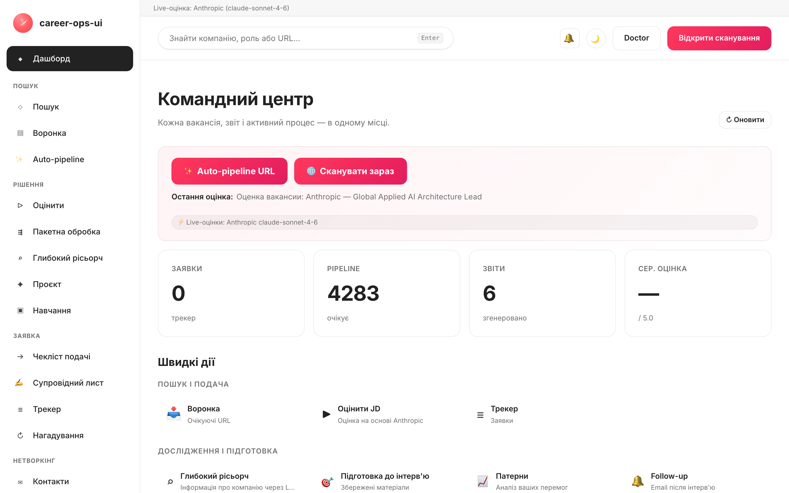

# career-ops-ui

> Лаконічний веб-інтерфейс у стилі технічної документації для AI-конвеєра пошуку роботи [career-ops](https://github.com/Fighter90/career-ops).
> Шукайте вакансії, оцінюйте їх, досліджуйте компанії, подавайте заявки та відстежуйте кожну пропозицію з однієї вкладки браузера — замість перемикання між Claude Code, терміналом і markdown-файлами.

[🇬🇧 English](README.md) | [🇪🇸 Español](README.es.md) | [🇧🇷 Português (Brasil)](README.pt-BR.md) | [🇰🇷 한국어](README.ko-KR.md) | [🇯🇵 日本語](README.ja.md) | [🇷🇺 Русский](README.ru.md) | [🇨🇳 简体中文](README.zh-CN.md) | [🇹🇼 繁體中文](README.zh-TW.md) | [🇫🇷 Français](README.fr.md) | [🇵🇱 Polski](README.pl.md) | **🇺🇦 Українська** | [🇩🇰 Dansk](README.da.md) | [🇸🇦 العربية](README.ar.md) | [🇩🇪 Deutsch](README.de.md) | [🇮🇹 Italiano](README.it.md) | [🇹🇷 Türkçe](README.tr.md) | [🇮🇳 हिन्दी](README.hi.md)

_Неофіційний інтерфейс — не пов'язаний із career-ops / santifer і не схвалений ними._

[](#тести)
[](#тести)
[](#тести)
[](#вимоги)
[](LICENSE)
[](https://github.com/Fighter90/career-ops-ui/releases/tag/v1.129.1)

> **🆕 Останній реліз — v1.129.1**
>
> **Доопрацювання за AI-рев'ю (патч).** v1.129.1 виправляє дорадчі зауваги портів web з v1.128/v1.129: порядок рівня в job-facets (`Senior Engineering Manager` → `senior`, не `lead`), `states.mjs` більше не пінить fallback при збої батька на старті (+попередження про пошкоджений файл), тон показує рядок без оцінки нейтральним (не червоним), а `domainFromName` пропускає не-ASCII slug. **Фасет «Рівень» + колонка «Свіжість» у скані.** v1.129.0 вплітає бібліотеку `job-facets.js` з v1.128.0 у `#/scan`: новий фільтр **Рівень** (lead/staff/senior/mid/junior/intern, автозаповнення з результатів як у фасета «Країна»), колонка-бейдж «Рівень» і zero-token колонка **Свіжість** (`сьогодні` / `Nдн`). **Чотири порти з веб-застосунку батька.** v1.128.0 переписує на ванільний JS чотири рішення з Next.js-застосунку career-ops: трекер читає канонічні статуси наживо з `templates/states.yml` (без хардкод-whitelist), бренд-логотипи на ATS-хостованих рядках через карту ім'я→домен, точніший 4-рівневий тон оцінки та zero-token бібліотеку фасетів. **2066 тестів**. **Паритет батька v1.23.0.** v1.127.0 портує три нові джерела — **Flowxtra**, **VDAB**, **iCIMS** (у реєстрі тепер **70 адаптерів**, 65 EN + 5 RU) —, віддзеркалює перехід agenticjobs на REST, відновлення міста в Greenhouse і фікси role-matcher, та повертає **Cursor** до ростера CLI (parent #2115 — `cli-detect` повідомляє 10 інструментів). **Патч дрейфу ростера CLI.** v1.126.1 виправляє дві точки, пропущені свіпом v1.126.0: інтро вкладки API keys у `#/config` (i18n ×17) тепер перелічує Antigravity + Grok Build, а застарілий рядок `Cursor / Gemini CLI` у довідці ×17 (і help сайту) тепер містить повний ростер із 8 CLI. **Ресинк доків і ростера CLI.** v1.126.0 звіряє кожну поверхню докумен­тації (help ×17, README ×17, wiki) з живою career-ops.org/docs (прочитано всі 31 сторінку) і навчає скан AI CLI tools у `#/config` виявляти всі 8 першокласних CLI — **Grok Build CLI** і **Kimi CLI** приєднуються до Claude Code, Cursor, Codex, OpenCode, Antigravity, Qwen і Copilot (тепер **9 інструментів**, як і раніше без запуску). **Сервісний синк.** v1.125.4 зводить dependabot-бампи site (`sharp` 0.35.3, `svgo` 4.0.2, `fast-uri` 3.1.4) і фіксує паріті-свіп батьківського проєкту (після v1.22.0, #2108–#2168): guard неправильного рядка в set-status, Risk Summary локалізованих режимів і перевірка маніфесту апдейтера — все на боці CLI, портувати нічого (**1969 тестів** без змін). **Фікс локалі промптів.** v1.125.3 робить данську та гінді повноправними в усіх AI-промптах — deep research (живий і ручний), режими, оцінювання, інтерв'ю, нетворкінг і CV Studio тепер видають директиву `# Output language` у цих двох локалях (раніше відповіді приходили англійською), а гейт локалей обходить усі 17 (**1969 тестів**). **Пакет зовнішніх контриб'юторів.** v1.125.2 вливає перші PR спільноти від [@Alien10140](https://github.com/Alien10140) — фікс HTTP 502 у живому Deep research (headless-промпти без інструментів для API-провайдерів) і оновлення типових моделей Gemini із застарілої `gemini-2.0-flash` на `gemini-3.6-flash`, закріплене новим анти-дрейф ґейтом із 5 тестів (**1957 тестів**). v1.125.1 зберігає мультибрендовим SuccessFactors RMK-тенантам їхній брендовий шлях (батьківський #2099). **Джерела вакансій на лендінгу.** v1.125.0 додає на cvstart.org розділ, що перелічує всі **70 джерел сканування** у вигляді клікабельних чіпів — синхронізований з реєстром під час збірки та захищений від розсинхронізації. До цього v1.124.0 портує **п'ять джерел сканування** — Welcome to the Jungle, Agentic Engineering Jobs, Jobvite, Gem і Alibaba Group (тепер **70 адаптерів**) — а також перевірку повністю віддаленої роботи Arbeitsagentur (`homeofficetyp=VOLLSTAENDIG`) і виправлення публічних URL SmartRecruiters.
>
> _патч AI-рев'ю · порядок рівня · fallback states · нейтральний тон · фасет рівня · колонка свіжості · job-facets вплетена · 4 порти web/ · states.yml наживо · логотипи ім'я→домен · тон · фасети · паритет батька v1.23 · +3 джерела · 70 адаптерів · Cursor · патч дрейфу ростера CLI · ресинк доків і ростера CLI · сервісний синк · фікс промпт-локалей da/hi · пакет зовнішніх контриб'юторів · фікс 502 у deep research · типові Gemini 3.6 · фікс брендового шляху SF · розділ джерел на лендінгу · 5 джерел · 67 адаптерів · паритет із батьківським v1.22 · Oracle Cloud · 62 адаптери · паритет із батьківським v1.21 · гінді · 17 мов · маніфест · сторінки methodology/license/changelog на cvstart.org · паритет із батьком v1.19 · 61 адаптер · живі зірки + контриб'ютори на лендінгу · паритет із батьком v1.18 · 54 адаптери · статус Hired · статистика за весь час · пакет паритету · 50 адаптерів · переробка лічильника витрат · шліфування дизайну · лічильник використання · плаваючий помічник довідки · консолідація доків та QA · закриття беклогу безпеки · докум. та QA ×16 · Виключити Scan · огляд пайплайна · посилення безпеки 2 · посилення санітайзера · посилення безпеки · витрати ШІ · логотипи компаній · інструменти CLI для ШІ · запитати довідку · адаптація CV + лист · автозаповнення two-pager · експорт у DOCX · здоров’я порталів · вбудований репортер багів · 16 locales · 6 LLM-провайдерів · 46 адаптерів сканера · кар'єрна орієнтація · план кар'єри · перероблення статистики · шар пам'яті · CV Studio · планувальник нетворкінгу · пробна співбесіда · ринкова відповідність через two-pager · паритет із батьківським career-ops v1.16.0._



## Про проєкт career-ops

[career-ops](https://career-ops.org) — це система пошуку роботи з відкритим кодом, що працює як набір slash-команд усередині будь-якого AI-CLI для програмістів (Claude Code, Cursor, Codex, OpenCode, Antigravity CLI, Grok Build CLI, Qwen Code, Kimi, GitHub Copilot CLI, Gemini CLI (legacy) — інші CLI, сумісні з Claude, також підтримуються через той самий інтерфейс slash-команд). Незалежна від моделі. Оцінює кожну вакансію відносно вашого CV за шестивимірною шкалою 0,0–5,0, генерує індивідуалізовані PDF-резюме та веде локальний трекер заявок — без хмарних акаунтів, телеметрії та автоматичного надсилання.

**Це репозиторій (career-ops-ui)** — доопрацьований веб-інтерфейс поверх career-ops. CLI і надалі відповідає за заповнення форм (через Playwright MCP) та slash-команди; SPA додає CRM-подібну браузерну поверхню над тими самими файлами `cv.md` / `data/applications.md` / `reports/`. Обидва спільно використовують одні й ті самі дані.

**Порогові значення за оцінкою** (з [career-ops.org/docs](https://career-ops.org/docs)):

| Оцінка | Наступний крок |
|---|---|
| **≥ 4,5** | `/career-ops apply` — висока відповідність, надсилайте одразу |
| **4,0 – 4,4** | подавайте або `/career-ops contacto` для теплого знайомства |
| **3,5 – 3,9** | `/career-ops deep` — спочатку дослідіть компанію |
| **< 3,5** | пропустіть, якщо немає конкретної причини |

**Канонічні посібники** на [career-ops.org/docs](https://career-ops.org/docs):

- [Що таке career-ops](https://career-ops.org/docs/introduction/what-is-career-ops)
- [Сканування порталів вакансій](https://career-ops.org/docs/introduction/guides/scan-job-portals)
- [Подання заявки](https://career-ops.org/docs/introduction/guides/apply-for-a-job)
- [Пакетна оцінка пропозицій](https://career-ops.org/docs/introduction/guides/batch-evaluate-offers)
- [Налаштування Playwright](https://career-ops.org/docs/introduction/guides/set-up-playwright)
- [Як career-ops оцінює вакансії — методологія](https://career-ops.org/methodology)

## Маніфест CareerOps

career-ops — перша еталонна реалізація [Маніфесту CareerOps](https://career-ops.org/manifesto) — практики ведення пошуку роботи з доказами, дисципліною та інструментами на боці кандидата за столом переговорів. Прочитайте його. Якщо він говорить те, у що ви вірите, підпишіть — ваш підпис стає комітом. Застосунок посилається на нього з футера бічної панелі.

## Ключові можливості

| Сторінка | Призначення |
|---|---|
| **Дашборд** | Зведені лічильники, середній бал, останні заявки та звіти |
| **Сканування** | Кнопка 🌐 Scan запускає всі налаштовані джерела (Greenhouse / Ashby / Lever / Workable / SmartRecruiters / Workday + hh.ru / Habr Career) за один прохід; результати в реальному часі через SSE |
| **Pipeline** | Управління `data/pipeline.md`; безпечний прев'ю URL (захист від SSRF) |
| **Оцінка** | Вставте опис вакансії → оцінка 0–5 через Anthropic або Gemini; fallback на готовий промпт |
| **Глибокий аналіз** | Дослідження компанії через Anthropic SDK; результати зберігаються в `interview-prep/` |
| **Трекер** | Фільтрована таблиця заявок над `data/applications.md` |
| **CV** | Live-редактор markdown із бічним прев'ю та серверним захистом від XSS |
| **Здоров'я системи** | Значки стану конфігурації; запуск `doctor.mjs` одним кліком |
| **Допомога** | Вбудована документація у 12 мовах (включно з українською) |

## Швидкий старт

> **Важливо — career-ops-ui — це дашборд *поверх* [`Fighter90/career-ops`](https://github.com/Fighter90/career-ops).** Він працює **всередині** проєкту career-ops як `career-ops/web-ui/` і зчитує файли `cv.md`, `config/`, `data/` з батьківської папки через `../`. **Не працює автономно** — вам також потрібен батьківський репозиторій career-ops.

### Варіант 1 — одна команда curl (рекомендовано)

```bash
curl -fsSL https://raw.githubusercontent.com/Fighter90/career-ops-ui/main/bin/setup.sh | bash
```

Клонує **обидва** репозиторії, організовує структуру `career-ops/web-ui/`, встановлює залежності, запускає діагностику та стартує сервер на http://127.0.0.1:4317.

### Варіант 2 — додати UI до наявного проєкту career-ops

```bash
cd career-ops
git clone https://github.com/Fighter90/career-ops-ui.git web-ui
cd web-ui
npm install
npm start
```

Відкрийте http://127.0.0.1:4317 у браузері.

### CLI-команди

```bash
career-ops-ui setup    # bootstrap: встановлення залежностей → діагностика → запуск
career-ops-ui init     # вибір постачальника LLM та вставлення ключа API (інтерактивно)
career-ops-ui doctor   # перевірка Node / проєкту / ключів / Playwright
career-ops-ui run      # запуск сервера на http://127.0.0.1:4317
career-ops-ui open     # відкриття та виведення на передній план вкладки дашборду
career-ops-ui help     # список усіх команд
```

### Вибір постачальника LLM

`init` — це майстер налаштування постачальника: виберіть **Claude / Claude Code** (`ANTHROPIC_API_KEY`), **Codex / OpenCode** (`OPENAI_API_KEY`), **Qwen Code** (`QWEN_API_KEY`) або **Auto** (Anthropic → fallback Gemini). Ключі можна також задати вручну:

```bash
echo "ANTHROPIC_API_KEY=sk-ant-..." >> career-ops/.env
```

Або через вкладку **Налаштування застосунку** (`#/config`) в UI — без перезапуску сервера.

## Вимоги

| | |
|---|---|
| **Node.js** | ≥ 18 (нативні `fetch` та `node:test`) |
| **career-ops** | клонований та налаштований (дивіться вище) |
| **Опціонально** | `ANTHROPIC_API_KEY` або `GEMINI_API_KEY` у `.env` батьківського проєкту для оцінки JD одним кліком |

## Архітектура в короткому викладі

```
career-ops/
├─ cv.md
├─ portals.yml
├─ config/
├─ data/
└─ web-ui/          ← це репозиторій
   ├─ server/       # Express + 15 модулів маршрутів
   ├─ public/       # vanilla JS SPA, без бандлера
   └─ tests/        # 1945 unit + 90 Playwright + 43 e2e
```

Сервер має дві виробничі залежності: `express` та `js-yaml`. Жодного transpile, жодного бандлера — весь UI займає менше 30 KB у мінімізованому вигляді.

## Повна документація

Вичерпна документація доступна лише англійською мовою: **[🇬🇧 README.md](README.md)**

Вона містить докладні описи:
- Повного REST API (всі ендпоінти `/api/*`)
- Налаштування сканера порталів (Greenhouse, Ashby, Lever, Workable, hh.ru, Habr Career, RSS)
- Усіх змінних оточення
- Принципів безпеки (SSRF, XSS, rate limiting)
- Архітектурного посібника (SDD, конвенції)

Офіційний сайт: [career-ops.org](https://career-ops.org) · Документація: [career-ops.org/docs](https://career-ops.org/docs)

## Тести

```bash
npm test                    # 1945 unit/integration-тестів
npm run test:e2e            # 20 smoke e2e
npm run test:e2e:full       # 23 comprehensive e2e
npm run test:e2e:browser    # 70 тестів Playwright
npm run test:coverage       # те саме + покриття V8
```

## Ліцензія

MIT. Деталі: [LICENSE](LICENSE).

Побудовано на основі [career-ops](https://github.com/Fighter90/career-ops) від [santifer](https://santifer.io).

<p>
  <a href="https://github.com/Fighter90" title="Fighter90"></a>
  <a href="https://github.com/Alien10140" title="Alien10140"></a>
  <a href="https://github.com/vignyl" title="vignyl"></a>
  <a href="https://github.com/bracketouverte" title="bracketouverte"></a>
</p>

**[Усі контриб'ютори →](https://github.com/Fighter90/career-ops-ui/graphs/contributors)**
